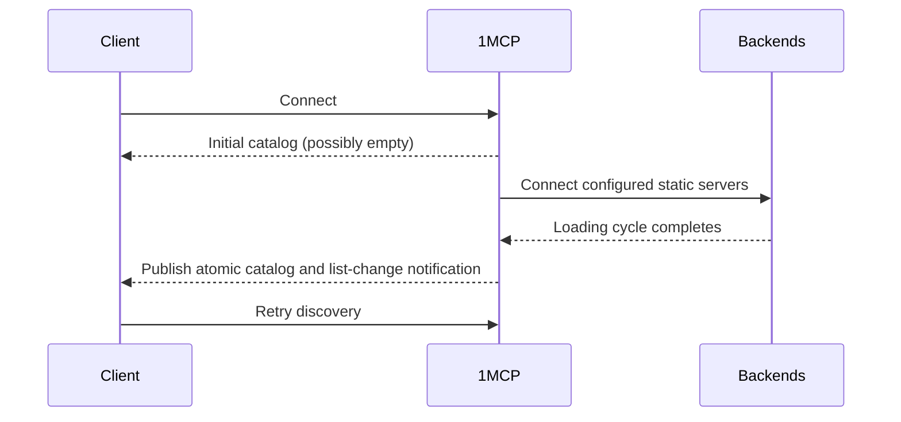

# Fast Startup: Async Server Loading

Async loading makes the HTTP listener available before configured static MCP servers finish connecting. It does not make every MCP client safe to use an incomplete capability catalog.

## Default and Compatibility

Synchronous startup is the default. It waits to publish a complete initial catalog and is the safe choice unless client behavior is known.

| Client behavior | Recommended startup | Reason |
| --- | --- | --- |
| Reads the catalog once and never refreshes | Synchronous (default) | It requires the complete initial catalog. |
| Handles capability-list change notifications and retries discovery | Async is suitable | It can reconcile after a new snapshot is published. |
| Is gated from using the catalog until loading completes | Async is suitable | The deployment gate protects its first catalog read. |
| Unknown or mixed compatibility | Synchronous (default) | Notification support is unverified. |

Enable async loading only when early HTTP availability is worth this contract:

```bash
npx -y @1mcp/agent --config mcp.json --enable-async-loading
```

## Catalog Publication

In async mode, the early catalog can be empty. 1MCP connects static backends in the background, builds the next capability snapshot, then publishes that snapshot atomically. It does not progressively expose one newly connected server at a time.

Compatible clients must process capability-list change notifications and retry discovery. A client that ignores those notifications can retain the empty or prior catalog until it reconnects.



## Client-Facing Status

Use the authenticated `/api/v1/inspect` endpoint or its CLI equivalent for client-facing status. It lists configured static servers before the first atomic capability snapshot. Known unavailable static servers return a normal inspect result with no tools; unknown names remain not found.

```bash
1mcp inspect
1mcp inspect filesystem
1mcp wait
1mcp wait filesystem --timeout 60000
```

`wait` only tracks enabled configured static servers. It excludes templates and disabled servers, never cancels background loading, and stops immediately for `failed`, `cancelled`, or `awaiting_oauth` states. `run` checks this client-facing status before falling back to MCP, so it returns a recovery command while a backend is loading instead of attempting an unsafe early invocation.

| State | Meaning | Action |
| --- | --- | --- |
| `pending` / `loading` | Startup is still in progress | `1mcp wait <server>` |
| `failed` / `cancelled` | No usable backend is available | Check configuration or restart the backend |
| `awaiting_oauth` | Provider authorization is required | Complete the OAuth flow shown by inspect |
| `connected` | The backend is callable | Inspect or run tools |

## Health Endpoints

`/health/ready` and `/health/mcp` answer different questions:

- `/health/ready` reports whether runtime configuration is ready to accept HTTP traffic. It is not a claim that every MCP backend has completed startup.
- `/health/mcp` is the operational backend-progress view, including loading and retry detail.

```bash
curl http://localhost:3050/health/ready
curl http://localhost:3050/health/mcp
```

Use the inspect API or CLI for an authenticated caller deciding whether to invoke a tool. Use health endpoints for monitoring.

## Configuration Notes

Async loading remains opt-in. This page describes the runtime contract rather than deprecated-option cleanup; use current command help and the configuration reference for supported options.
