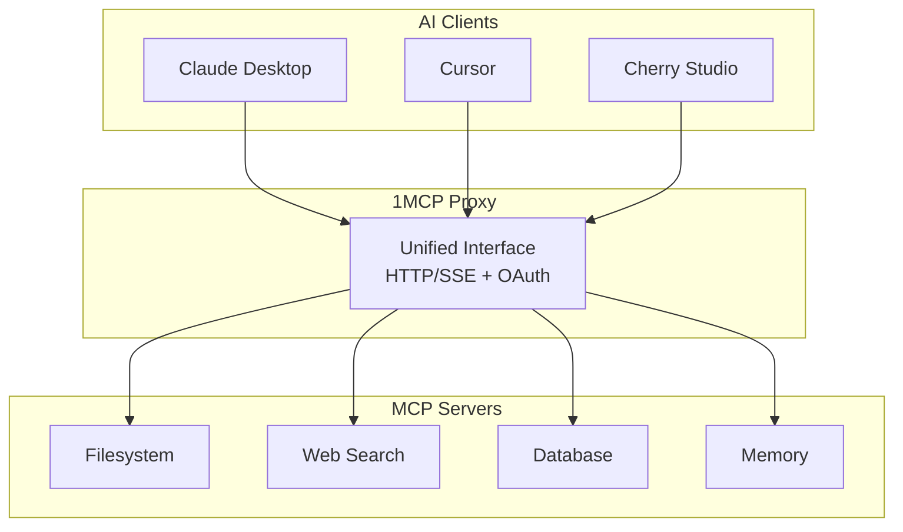

## Why 1MCP?

**The Problem**: AI assistants need to connect to multiple MCP servers, but managing dozens of individual connections is complex, unreliable, and security-intensive.

**The Solution**: 1MCP acts as a unified proxy/multiplexer that aggregates multiple MCP servers behind a single, reliable interface. Learn more about our [core features](/guide/essentials/core-features) and [security architecture](/reference/security).



## Quick Example

Start with a simple configuration. For complete setup instructions, see our [getting started guide](/guide/getting-started) and [installation instructions](/guide/installation).

```json
{
  "mcpServers": {
    "context7": {
      "command": "npx",
      "args": ["-y", "@upstash/context7-mcp@latest"],
      "tags": ["context7", "docs", "development", "code"],
      "disabled": false
    },
    "git": {
      "command": "uvx",
      "args": ["mcp-server-git", "--repository", "/path/to/your/awesome-project"],
      "tags": ["git", "awesome-project"],
      "disabled": false
    },
    "filesystem": {
      "command": "npx",
      "args": ["-y", "@modelcontextprotocol/server-filesystem", "/tmp"],
      "tags": ["files", "tmpdir"],
      "disabled": false
    },
    "server-sequential-thinking": {
      "command": "npx",
      "args": ["-y", "@modelcontextprotocol/server-sequential-thinking"],
      "tags": ["thinking"],
      "disabled": false
    },
    "playwright": {
      "command": "npx",
      "args": ["-y", "@playwright/mcp@latest"],
      "tags": ["playwright", "frontend", "web", "ui", "browser"],
      "disabled": false
    }
  }
}
```

```bash
# Start the proxy
npx -y @1mcp/agent --config mcp.json --port 3000
```

Now your agent is running. Connect your MCP client to `http://localhost:3000` to start using your aggregated tools. Check our [server management guide](/guide/essentials/server-management) for advanced configuration options.

## Key Benefits

- **🎯 Simplified Integration**: One connection instead of many
- **🔐 Production Security**: OAuth 2.1 with scope-based permissions
- **📈 Better Reliability**: Centralized error handling and monitoring
- **⚙️ Easy Management**: Single configuration, hot-reload support
- **🚀 Performance**: Efficient multiplexing with minimal overhead

## What's Next?

<div class="vp-feature-grid">
  <a href="/guide/getting-started" class="vp-feature-box">
    <h3>📚 Learn the Basics</h3>
    <p>Understand 1MCP architecture and core concepts</p>
  </a>

  <a href="/guide/quick-start" class="vp-feature-box">
    <h3>⚡ Quick Start</h3>
    <p>Get running in 5 minutes with basic configuration</p>
  </a>

  <a href="/reference/architecture" class="vp-feature-box">
    <h3>🏗️ Deep Dive</h3>
    <p>Comprehensive system architecture and design decisions</p>
  </a>
</div>

<style>
.vp-feature-grid {
  display: grid;
  grid-template-columns: repeat(auto-fit, minmax(250px, 1fr));
  gap: 1rem;
  margin-top: 2rem;
}

.vp-feature-box {
  padding: 1.5rem;
  border: 1px solid var(--vp-c-border);
  border-radius: 8px;
  text-decoration: none;
  transition: border-color 0.25s;
}

.vp-feature-box:hover {
  border-color: var(--vp-c-brand);
}

.vp-feature-box h3 {
  margin: 0 0 0.5rem 0;
  font-size: 1.1rem;
}

.vp-feature-box p {
  margin: 0;
  color: var(--vp-c-text-2);
  line-height: 1.4;
}
</style>
