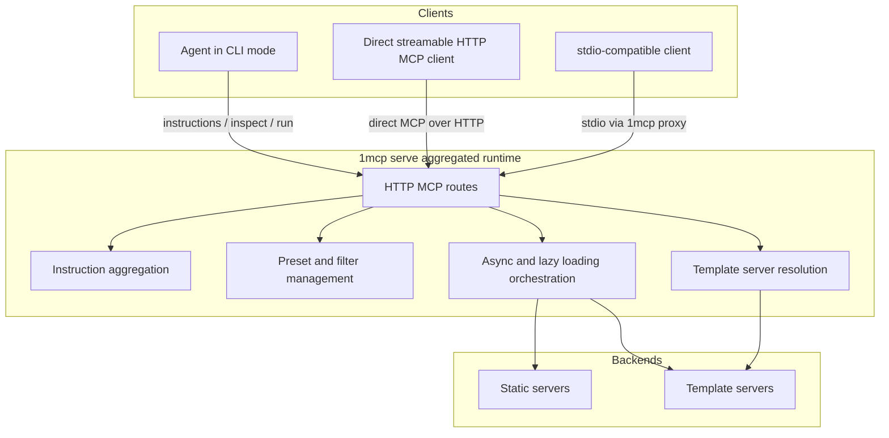

# 1MCP Architecture

1MCP has two layers that should be understood together:

- `1mcp serve` is the aggregated runtime.
- CLI mode is an agent-facing progressive-disclosure workflow on the runtime.

CLI mode does not replace MCP. It changes how an agent discovers and executes tools while the runtime still speaks MCP to clients and backend servers.

## System Overview


```mermaid
flowchart TB
    subgraph Clients
        A1[Agent in CLI mode]
        A2[Direct streamable HTTP MCP client]
        A3[stdio-compatible client]
    end

    subgraph Runtime["1mcp serve aggregated runtime"]
        B1[HTTP MCP routes]
        B2[Instruction aggregation]
        B3[Preset and filter management]
        B4[Async and lazy loading orchestration]
        B5[Template server resolution]
    end

    subgraph Backends
        C1[Static servers]
        C2[Template servers]
    end

    A1 -->|instructions / inspect / run| B1
    A2 -->|direct MCP over HTTP| B1
    A3 -->|stdio via 1mcp proxy| B1
    B1 --> B2
    B1 --> B3
    B1 --> B4
    B1 --> B5
    B5 --> C2
    B4 --> C1
    B4 --> C2
```

The runtime centralizes server lifecycle, transport routing, filtering, instruction collection, and session-aware template handling. The important shift in the current architecture is that 1MCP is no longer best described as only a proxy surface. It is a runtime that can expose different client interfaces over the same aggregated server inventory.

## Main Runtime Flows

### Startup flow

1. `serve` loads configuration and initializes config-change handling.
2. Preset management is initialized, including preset change notifications.
3. Static server transports are created from startup configuration.
4. Template servers are not fully materialized at startup. They are created later from client or session context.
5. The runtime starts in either synchronous or async loading mode.

### Agent CLI flow

1. A user bootstraps Codex or Claude with `1mcp cli-setup --codex` or `1mcp cli-setup --claude --scope repo --repo-root .`.
2. The agent talks to a running `serve` instance through `instructions`, `inspect`, and `run`.
3. Each step narrows context from inventory to server to tool schema to tool call.

### Direct MCP flow

1. An MCP-native client connects to the HTTP endpoint exposed by `serve`.
2. The runtime resolves filters, presets, auth, and available connections.
3. Tool listing and tool calls are served from the aggregated inventory.

### stdio proxy flow

1. A stdio-compatible client starts `1mcp proxy`.
2. `proxy` discovers a running `serve` instance and forwards stdio traffic to the HTTP runtime.
3. Presets, `.1mcprc`, and template-aware context can still be applied, which makes `proxy` the recommended fallback after CLI mode.

## Key Components

### Aggregated runtime

`1mcp serve` is the long-lived process that owns config loading, client routing, transport exposure, and backend server management.

### Server manager

The runtime keeps a server manager that tracks outbound server connections and inbound client sessions, including instruction updates and template-backed lifecycle cleanup.

### Instruction aggregation

Instruction aggregation is a first-class system concern. Static and template-backed servers can contribute instructions, and the runtime combines them for clients and CLI mode.

### Template server manager

Template servers are created from contextual configuration rather than treated as static startup inventory. They can be shareable or session-scoped, and the runtime tracks rendered hashes and session mappings for correct routing and cleanup.

### Preset manager and notifications

Presets are initialized as part of server startup. Changes to presets can trigger notifications so connected clients can react to inventory changes without treating presets as out-of-band config.

## Loading Model

The runtime supports both startup-time loading and progressive loading behavior.

### Static versus template loading

- Static servers are created from startup configuration.
- Template servers are created per client or session after context is known.

### Async loading

When async loading is enabled, the HTTP runtime can start immediately while static MCP servers load in the background. This reduces startup blocking and lets the runtime expose partial availability sooner.

### Lazy loading

When lazy loading is enabled, server exposure can stay narrower until tools are actually needed. Lazy loading integrates with the runtime rather than existing as a separate proxy trick.

### Instruction behavior during loading

Instruction aggregation is initialized before the full backend inventory is necessarily ready. As more servers become available, the runtime can update the instruction view and client-visible inventory.

## Configuration / Presets / Templates

Configuration is no longer best summarized as “one JSON file.” The current system combines several configuration concerns:

- startup configuration for static servers
- template definitions that render from context
- preset definitions and selection
- CLI and project-level options such as filters or `.1mcprc`
- runtime feature flags such as async loading, lazy loading, and session persistence

Template server resolution is session-aware where needed. Inspect and tool routes can initialize template servers using request context and session IDs so a client sees the right contextual inventory.

## Client Interfaces

1MCP exposes three distinct client-facing surfaces:

### CLI mode

This is the recommended workflow for agent loops:

```bash
1mcp instructions
1mcp inspect <server>
1mcp inspect <server>/<tool>
1mcp run <server>/<tool> --args '<json>'
```

CLI mode is a progressive agent interface, not a replacement wire protocol.

### Direct HTTP MCP attachment

This is the right fit for MCP-native clients that want to connect directly to the aggregated runtime over streamable HTTP and do not need project context.

### `proxy`

`1mcp proxy` is the maximum-compatibility client surface after CLI mode. It bridges local stdio clients to a running HTTP runtime while preserving project context through `.1mcprc` and supporting template-aware runtime behavior.

## Security and Operational Boundaries

- `serve` is the runtime boundary where auth, rate limits, request handling, and health endpoints live.
- Template resolution happens inside the runtime and is constrained by provided client or session context.
- `proxy` does not add OAuth capability to stdio clients; if a client cannot authenticate, that limitation remains.
- Presets and filters can narrow exposure, but they do not replace transport-level auth or server-side operational controls.

In short: the current architecture is a unified runtime with multiple client surfaces, not just an HTTP framing layer in front of subprocesses.
