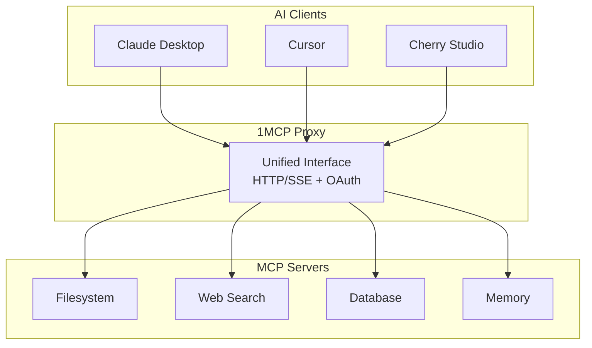
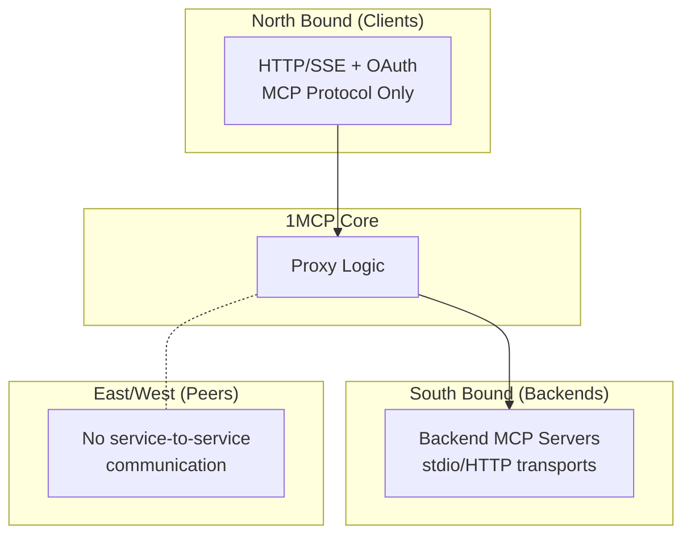

# 1MCP System Architecture

> **Vision**: A unified, reliable proxy that makes multiple MCP servers appear as one, simplifying AI assistant integration while maintaining security and performance.

## 🎯 Purpose & Context

**Problem**: AI assistants need to connect to multiple MCP servers, but managing dozens of individual connections is complex, unreliable, and security-intensive.

**Solution**: 1MCP acts as a unified proxy/multiplexer that aggregates multiple MCP servers behind a single, reliable interface.

**Success Metrics**:

- **Reliability**: Stable operation with proper error handling
- **Performance**: Efficient request forwarding to backend servers
- **Security**: OAuth 2.1 authentication and secure defaults
- **Simplicity**: Single configuration file, easy deployment



## 📏 System Constraints

### **Hard Constraints**

- **Single Binary**: Must deploy as one executable, no external dependencies
- **MCP Protocol**: Must be 100% compatible with MCP [Latest specification](https://modelcontextprotocol.io/specification/latest)
- **Stdio Transport**: Backend servers communicate via stdio or streamable http (security boundary)
- **Configuration**: All config via single JSON file, hot-reloadable

### **Soft Constraints**

- **Concurrent Connections**: Handle multiple simultaneous client connections
- **Backend Servers**: Support multiple MCP servers per instance
- **Network**: Works behind corporate firewalls (HTTP/SSE only)
- **Startup Time**: Fast startup for development iterations
- **Dependencies**: Minimal external dependencies for security

### **Why These Constraints**

- **Single Binary**: Enterprise deployment requirement - no complex setup
- **Multi-Transport**: Backend servers support stdio, HTTP, and streamable HTTP transports
- **Hot Reload**: Zero-downtime configuration updates required

## 🏗️ Architectural Principles

### **Principle 1: Reliability Over Performance**

- System must stay operational even if individual backends fail
- Graceful degradation preferred over fast failure
- Connection management with retry logic and timeouts

### **Principle 2: Security by Default**

- All endpoints require authentication unless explicitly disabled
- Backend servers run in isolated processes with secure transport protocols
- Input sanitization on all external data
- No sensitive data in logs

### **Principle 3: Simplicity Over Flexibility**

- Single deployment model, not configurable
- Convention over configuration where possible
- Explicit rather than implicit behavior

### **Principle 4: Transparency to Clients**

- MCP protocol compliance - clients don't know it's a proxy
- Error messages preserve backend server context
- No protocol modifications or extensions

## 🔄 Decision Framework

When evaluating new features or changes, ask:

### **Reliability Questions**

- Does this reduce system availability?
- What happens if this component fails?
- Can the system continue operating without it?

### **Security Questions**

- Does this expand the attack surface?
- Could this leak sensitive information?
- Are we maintaining defense in depth?

### **Simplicity Questions**

- Does this add configuration complexity?
- Will this make deployment harder?
- Can we solve this with existing patterns?

### **Compatibility Questions**

- Does this break MCP protocol compliance?
- Will existing clients continue to work?
- Are we preserving backend server interfaces?

## 📊 Quality Attribute Scenarios

### **Reliability Scenario**

- **Situation**: Backend MCP server crashes during request processing
- **Response**: System detects failure, marks server unavailable, retries request on other servers if applicable
- **Measure**: <5 second recovery, client receives appropriate error, system remains available
- **Current**: Connection pooling with health checks, exponential backoff retry

### **Security Scenario**

- **Situation**: Client attempts to access MCP server without proper authorization
- **Response**: OAuth token validation, scope checking, request denied with 403
- **Measure**: Zero unauthorized access, all attempts logged with client context
- **Current**: OAuth 2.1 with scope-based authorization, session management

### **Performance Scenario**

- **Situation**: Multiple concurrent clients making requests to backend servers
- **Response**: Efficient request forwarding, proper error handling, async processing
- **Measure**: Reliable request processing, system remains responsive
- **Current**: Express.js with proper error handling, async request forwarding

### **Maintainability Scenario**

- **Situation**: New MCP server added to configuration file
- **Response**: Hot reload detects change, spawns new server process, updates routing
- **Measure**: <30 seconds to become available, zero downtime
- **Current**: File system watching with debounced reload, graceful process management

## 🚫 System Boundaries & Anti-Patterns

### **What We Are**

- **MCP Protocol Proxy**: Faithful implementation of MCP specification
- **Authentication Gateway**: OAuth 2.1 security layer
- **Connection Multiplexer**: Many clients to many servers
- **Process Manager**: Lifecycle management for backend servers

### **What We Are NOT**

- **Business Logic Engine**: No data transformation or business rules
- **Caching Layer**: Every request goes to backend (for now)
- **Service Mesh**: Not a general-purpose service communication layer
- **Database**: No persistent storage of application data

### **Integration Boundaries**



### **Anti-Patterns We Avoid**

- **Shared Database**: No shared state between instances
- **Network Dependencies**: No calls to external services at runtime
- **Protocol Extensions**: No MCP protocol modifications
- **Synchronous Chains**: No blocking calls in request path
- **Global State**: All state is request-scoped or configuration

## 🗺️ Evolution Strategy

### **Phase 1: Single Instance Proxy** (Current)

- **Scope**: One 1MCP instance per deployment
- **Features**: HTTP/SSE transport, OAuth, basic connection pooling
- **Constraints**: No horizontal scaling, local configuration only

### **Phase 2: Enhanced Features** (Future)

- **Scope**: Additional operational features based on user feedback
- **Features**: Enhanced monitoring, advanced configuration options
- **Migration**: Backward compatible, optional enhancements

### **Phase 3: Advanced Capabilities** (Future)

- **Scope**: Advanced features for enterprise use cases
- **Features**: Enhanced security, operational improvements
- **Migration**: Configuration extensions, no protocol changes

### **Evolution Principles**

- **Backward Compatibility**: Existing deployments continue working
- **Progressive Enhancement**: New features are opt-in
- **Zero Downtime**: All migrations support hot upgrades
- **Configuration Driven**: Features enabled through configuration

## ⚡ Architecture Validation

### **Automated Architecture Testing**

```typescript
// Example: Architecture tests enforce our boundaries
describe('Architecture Constraints', () => {
  test('No business logic in transport layer', () => {
    // Static analysis ensures transport only handles HTTP/auth
  });

  test('All external calls use circuit breakers', () => {
    // Validate resilience patterns are used
  });

  test('No direct database access outside repositories', () => {
    // Enforce data access patterns
  });
});
```

### **Architecture Metrics**

- **Dependency Violations**: 0 (enforced by tests)
- **Cyclomatic Complexity**: <10 per function (linting)
- **Security Scan**: 0 high/critical vulnerabilities
- **API Compatibility**: 100% MCP protocol compliance
- **Test Coverage**: >90% for critical paths

### **Continuous Validation**

- Architecture tests run in CI/CD pipeline
- Dependency analysis in pull requests
- Security scanning on every build
- Performance regression testing

## 🔍 Observability & Monitoring

### **Health Indicators**

- **System Health**: All core components operational
- **Backend Health**: Individual MCP server status
- **Connection Health**: Client connection pool status
- **Configuration Health**: Config file validity and reload status

### **Key Metrics**

- **Availability**: System uptime percentage
- **Latency**: Request response time distribution
- **Throughput**: Requests per second capacity
- **Error Rate**: Failed requests percentage
- **Resource Usage**: Memory, CPU, connection counts

### **Monitoring Indicators**

- **Critical**: System unavailable, authentication failures, configuration errors
- **Warning**: Backend server disconnections, repeated request failures
- **Info**: Configuration reloaded, new client connections, successful operations

## 🚨 Failure Modes & Recovery

### **Failure Categories**

#### **Backend Server Failures**

- **Symptoms**: Process crash, unresponsive, invalid responses
- **Detection**: Health checks, request timeouts, error patterns
- **Recovery**: Process restart, connection retry, graceful degradation
- **Escalation**: Remove from rotation, alert operators

#### **Configuration Failures**

- **Symptoms**: Invalid JSON, missing servers, permission errors
- **Detection**: File parsing errors, validation failures
- **Recovery**: Retain previous valid configuration, log errors
- **Escalation**: Disable hot-reload, require manual intervention

#### **Resource Exhaustion**

- **Symptoms**: High memory usage, connection limits hit, slow responses
- **Detection**: Resource monitoring, performance degradation
- **Recovery**: Connection throttling, graceful degradation, load shedding
- **Escalation**: Service restart, horizontal scaling

#### **Security Breaches**

- **Symptoms**: Authentication bypass, unauthorized access, token leakage
- **Detection**: Security monitoring, anomaly detection, audit logs
- **Recovery**: Immediate service isolation, token revocation, forensic analysis
- **Escalation**: Complete service shutdown, incident response procedures

### **Recovery Expectations**

- **Backend Reconnection**: Automatic with retry logic
- **Configuration Reload**: Immediate detection and application
- **Security Incident**: Immediate authentication failure response
- **System Recovery**: Restart and reload as needed

## 🏗️ Code Structure & Organization

### **Project Layout**

The codebase follows a layered architecture with clear separation of concerns:

```
src/
├── application/             # Application-level services
│   └── services/            # Cross-cutting orchestration services
│       ├── configReloadService.ts
│       ├── healthService.ts
│       └── tokenEstimationService.ts
├── auth/                    # Authentication & authorization
│   ├── storage/             # Repository pattern for auth data
│   ├── sdkOAuthClientProvider.ts
│   ├── sdkOAuthServerProvider.ts
│   └── sessionTypes.ts
├── commands/                # CLI command implementations
│   ├── app/                 # App management commands
│   ├── mcp/                 # MCP server management commands
│   ├── preset/              # Preset management commands
│   ├── proxy/               # Proxy commands
│   ├── serve/               # Server commands
│   └── shared/              # Shared command utilities
├── config/                  # Configuration management
│   ├── configContext.ts
│   ├── mcpConfigManager.ts
│   ├── envProcessor.ts
│   ├── projectConfigLoader.ts
│   └── projectConfigTypes.ts
├── constants/               # Domain-organized constants
│   ├── api.ts               # API endpoints, ports, hosts
│   ├── auth.ts              # Authentication constants
│   ├── mcp.ts               # MCP protocol constants
│   ├── paths.ts             # File paths, directories
│   └── index.ts             # Barrel export
├── core/                    # Core business logic
│   ├── capabilities/        # MCP capability management
│   ├── client/              # Client management
│   ├── filtering/           # Request filtering logic
│   ├── instructions/        # Template engine
│   ├── loading/             # Async loading orchestration
│   ├── notifications/       # Notification system
│   ├── protocol/            # Protocol message handlers
│   ├── server/              # Server lifecycle management
│   └── types/               # Shared type definitions
├── domains/                 # Domain modules
│   ├── backup/              # Backup management domain
│   ├── discovery/           # App discovery domain
│   └── preset/              # Preset management domain
│       ├── manager/         # PresetManager
│       ├── parsers/         # Tag query parsing
│       ├── services/        # Preset services
│       └── types/           # Preset types
├── logger/                  # Logging infrastructure
│   ├── configureGlobalLogger.ts
│   └── [6 other logger files]
├── transport/               # Transport layer implementations
│   ├── http/                # HTTP/SSE transport
│   │   ├── middlewares/     # Express middlewares
│   │   └── routes/          # API route handlers
│   └── [5 transport files]
└── utils/                   # Generic utilities
    ├── core/                # Core utilities
    ├── ui/                  # CLI utilities
    └── validation/          # Input validation
```

### **Architectural Layers**

#### **1. Application Layer (`application/`)**

- **Purpose**: Cross-cutting orchestration services
- **Responsibilities**: Configuration reloading, health monitoring, token estimation
- **Dependencies**: Can depend on core and domains
- **Examples**: `configReloadService`, `healthService`

#### **2. Core Layer (`core/`)**

- **Purpose**: Core business logic and domain entities
- **Responsibilities**: MCP protocol handling, capability management, server lifecycle
- **Dependencies**: Should not depend on application layer
- **Examples**: `ServerManager`, `ClientManager`, `CapabilityManager`

#### **3. Domain Layer (`domains/`)**

- **Purpose**: Self-contained business domains
- **Responsibilities**: Specific business logic (presets, discovery, backup)
- **Dependencies**: Can depend on core, should be independent
- **Examples**: `PresetManager`, `BackupManager`, `AppDiscovery`

#### **4. Transport Layer (`transport/`)**

- **Purpose**: Protocol implementations and communication
- **Responsibilities**: HTTP/SSE, STDIO, message routing
- **Dependencies**: Can depend on core and application
- **Examples**: `ExpressServer`, `StdioTransport`

#### **5. Infrastructure Layer (`auth/`, `config/`, `logger/`)**

- **Purpose**: Cross-cutting infrastructure concerns
- **Responsibilities**: Authentication, configuration, logging
- **Dependencies**: Minimal dependencies, used by all layers
- **Examples**: `McpConfigManager`, `OAuthClientProvider`

### **Design Principles**

#### **Domain-Driven Design**

- **Domains**: Self-contained modules with clear boundaries
- **Services**: Application-level orchestration
- **Core**: Shared business logic and entities

#### **Dependency Direction**

```
Application → Core → Domains
     ↓         ↓
Transport → Infrastructure
```

#### **File Organization**

- **Co-location**: Related files grouped together
- **Barrel Exports**: Clean import paths with `index.ts`
- **Domain Boundaries**: Clear ownership and responsibilities

#### **Naming Conventions**

- **Managers**: `*Manager.ts` for stateful services
- **Services**: `*Service.ts` for stateless operations
- **Types**: `*Types.ts` for type definitions
- **Utils**: Generic utilities only

### **Migration Benefits**

The restructured codebase provides:

- **57% reduction** in utils files (47 → 20)
- **Clear domain boundaries** with dedicated modules
- **Better maintainability** through organized structure
- **Improved scalability** with independent domains
- **Enhanced developer experience** with clear file locations

---

> **This architecture serves as our decision-making framework. When in doubt, refer back to our principles and constraints. All changes should strengthen these foundations, not weaken them.**
