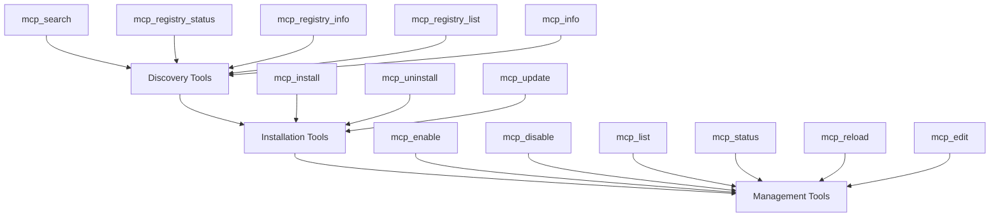

# Internal Tools Overview

Internal tools are MCP protocol tools that enable AI assistants to programmatically manage MCP servers within the 1MCP ecosystem. These tools provide comprehensive automation capabilities for server discovery, installation, and operational management.

## Purpose and Design

Internal tools are specifically designed for **AI assistant integration**, not human interaction. While CLI commands provide user-friendly interfaces for server management, internal tools offer programmatic access with:

- **Structured input/output** following MCP protocol standards
- **Comprehensive schemas** with validation and type safety
- **Atomic operations** with rollback and error handling
- **Automation-friendly** workflows and state management

## Enabling Internal Tools

Internal tools are disabled by default and must be explicitly enabled through CLI flags or environment variables. This ensures that only intended AI assistants can access these powerful management capabilities.

### CLI Flags

Enable internal tools when starting the 1MCP server:

```bash
# Enable ALL internal tools
./build/index.js serve --enable-internal-tools

# Enable specific tools by name
./build/index.js serve --internal-tools="search,list,status,registry"

# Enable tools by category
./build/index.js serve --internal-tools="discovery,management"

# Enable safe (read-only) tools only
./build/index.js serve --internal-tools="safe"
```

### Available Tool Categories

- **discovery**: Registry search and server discovery tools
- **installation**: Server installation, update, and removal tools
- **management**: Server control and configuration tools
- **safe**: Read-only tools (discovery + read-only management)

### Individual Tools

- **search**: `mcp_search` - Search MCP registry for servers
- **list**: `mcp_list` - List MCP servers with status
- **status**: `mcp_status` - Get detailed server status
- **registry**: Registry management tools
- **install/uninstall/update**: Installation tools
- **enable/disable/edit**: Management tools

### Security Considerations

When enabling internal tools:

- **Principle of Least Privilege**: Enable only the tools needed for your use case
- **Network Security**: Ensure 1MCP is accessible only to trusted AI assistants
- **Use Safe Mode**: Consider `--internal-tools="safe"` for read-only operations when possible
- **Monitor Usage**: Regularly review which tools are being used by AI assistants

### Examples

```bash
# Development environment - full access
./build/index.js serve --enable-internal-tools

# Production environment - discovery and management only
./build/index.js serve --internal-tools="discovery,management"

# Read-only monitoring setup
./build/index.js serve --internal-tools="safe"

# Specific server management scenario
./build/index.js serve --internal-tools="search,list,status,enable,disable"
```

## Tool Architecture

The internal tools system is organized into three logical domains that mirror the server lifecycle:



## Workflow Patterns

### Typical AI Assistant Workflow

AI assistants typically follow this pattern when using internal tools:

1. **Discovery Phase**
   - Use `mcp_registry_status` to check registry availability
   - Use `mcp_search` to find relevant servers
   - Use `mcp_info` to get detailed server information

2. **Installation Phase**
   - Use `mcp_install` to install required servers
   - Use `mcp_status` to verify installation success
   - Use `mcp_list` to confirm server availability

3. **Management Phase**
   - Use `mcp_enable`/`mcp_disable` to control server state
   - Use `mcp_status` for ongoing health monitoring
   - Use `mcp_reload`/`mcp_edit` for configuration changes

### Automation Workflow Example

```javascript
// Example AI assistant workflow for setting up a development environment

async function setupDevelopmentEnvironment() {
  // 1. Discover available servers
  const registryStatus = await mcp_registry_status();
  if (!registryStatus.isAvailable) {
    throw new Error('Registry not available');
  }

  // 2. Search for development tools
  const devTools = await mcp_search({
    query: 'development debugging tools',
    category: 'development',
  });

  // 3. Install required servers
  const installations = [];
  for (const server of devTools.results) {
    const installResult = await mcp_install({
      name: server.name,
      version: server.recommendedVersion,
    });
    installations.push(installResult);
  }

  // 4. Verify installation
  const serverList = await mcp_list();
  const installedServers = serverList.servers.filter((server) => server.status === 'running');

  // 5. Enable servers as needed
  for (const server of installedServers) {
    if (server.disabled) {
      await mcp_enable({ name: server.name });
    }
  }

  return {
    installed: installations.length,
    running: installedServers.length,
    servers: installedServers,
  };
}
```

## Key Capabilities

### Safe Operations

All internal tools prioritize operational safety:

- **Transaction support** with rollback capabilities
- **Dependency validation** to prevent breaking changes
- **Health checks** before and after operations
- **Backup creation** for destructive operations
- **Atomic commits** with proper cleanup

### Rich Feedback

Tools provide comprehensive operational feedback:

- **Progress indicators** for long-running operations
- **Detailed status information** including logs and metrics
- **Error context** with suggested resolutions
- **Operation history** for audit and debugging

### Integration Features

Designed for seamless AI assistant integration:

- **Semantic naming** following MCP conventions
- **Consistent schemas** across all tools
- **Cross-tool compatibility** with shared data structures
- **Extensible design** for future tool additions

## Tool Domains

### Discovery Tools

Focus on finding and evaluating MCP servers:

- **Registry integration** with multiple registry sources
- **Advanced search** with filtering and categorization
- **Server information** with capabilities and requirements
- **Health monitoring** for registry services

### Installation Tools

Handle complete server lifecycle management:

- **Flexible installation** from various sources (registry, git, custom)
- **Version management** with dependency resolution
- **Safe uninstallation** with backup and rollback
- **Update automation** with compatibility checking

### Management Tools

Provide operational control and monitoring:

- **State management** with graceful transitions
- **Configuration editing** with validation and hot-reload
- **Health monitoring** with detailed diagnostics
- **Performance tracking** with metrics and alerts

## Comparison with CLI Commands

| Aspect               | Internal Tools        | CLI Commands               |
| -------------------- | --------------------- | -------------------------- |
| **Target User**      | AI assistants         | Humans                     |
| **Interface**        | MCP protocol          | Command line               |
| **Output Format**    | Structured data       | Human-readable text        |
| **Error Handling**   | Structured exceptions | User-friendly messages     |
| **Automation**       | Native support        | Manual scripting required  |
| **Batch Operations** | Built-in capabilities | Requires shell scripting   |
| **Integration**      | Direct MCP access     | External process execution |

## Best Practices

### For AI Assistant Developers

- **Use structured error handling** with proper exception handling
- **Implement retry logic** for transient failures
- **Cache server information** to reduce registry calls
- **Validate prerequisites** before operations
- **Monitor operation progress** and provide user feedback

### For Tool Users

- **Plan operations** before execution to understand dependencies
- **Use status checks** to verify operation success
- **Implement backup strategies** for critical servers
- **Monitor server health** regularly
- **Document custom configurations** for reproducibility

## Next Steps

- **[Discovery Tools](./discovery)** - Learn about server discovery capabilities
- **[Installation Tools](./installation)** - Understand installation and lifecycle management
- **[Management Tools](./management)** - Explore operational control features
- **[Main Reference Page](../internal-tools.md)** - Complete reference documentation

## See Also

- [MCP Protocol Specification](https://modelcontextprotocol.io/) - Understanding the underlying protocol
- [CLI Commands Reference](../../commands/) - Human-friendly server management alternatives
