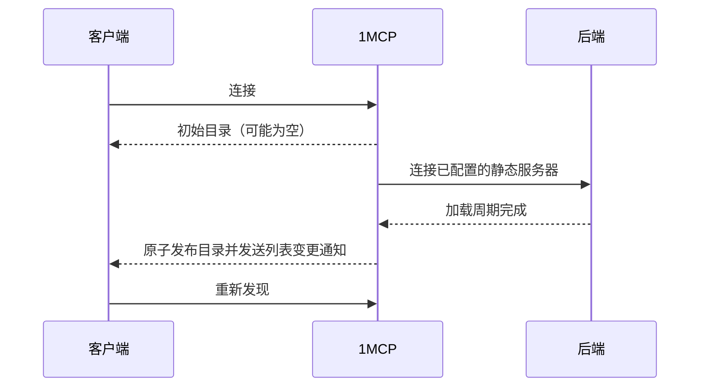

# 快速启动：异步服务器加载

异步加载会在已配置的静态 MCP 服务器完成连接前开放 HTTP 监听器；它不会让所有 MCP 客户端都能安全使用不完整的能力目录。

## 默认模式与兼容性

同步启动是默认模式。它会等待发布完整的初始目录；除非已知客户端行为，否则应选择同步模式。

| 客户端行为 | 建议启动方式 | 原因 |
| --- | --- | --- |
| 只读取一次目录且不会刷新 | 同步（默认） | 需要完整的初始目录。 |
| 能处理能力列表变更通知并重试发现 | 可使用异步 | 可在发布新快照后重新协调。 |
| 在加载完成前不会使用目录 | 可使用异步 | 部署门禁保护首次目录读取。 |
| 兼容性未知或混合 | 同步（默认） | 通知支持尚未验证。 |

只有在早期 HTTP 可用性值得采用该契约时，才启用异步加载：

```bash
npx -y @1mcp/agent --config mcp.json --enable-async-loading
```

## 目录发布

异步模式下，早期目录可能为空。1MCP 在后台连接静态后端、构建下一份能力快照，然后原子发布该快照；不会逐台暴露刚连接的服务器。

兼容客户端必须处理能力列表变更通知并重新发现。忽略通知的客户端会一直保留空目录或旧目录，直到重新连接。



## 面向客户端的状态

使用已认证的 `/api/v1/inspect` 端点或对应 CLI 查看面向客户端的状态。它会在首个原子能力快照发布前列出已配置的静态服务器。已知但不可用的静态服务器会返回正常 inspect 结果及空工具列表；未知名称仍会返回未找到。

```bash
1mcp inspect
1mcp inspect filesystem
1mcp wait
1mcp wait filesystem --timeout 60000
```

`wait` 只跟踪已启用的已配置静态服务器，会排除模板和已禁用服务器，绝不会取消后台加载；遇到 `failed`、`cancelled` 或 `awaiting_oauth` 会立即结束。`run` 会在回退到 MCP 前检查该面向客户端的状态，因此后端仍在加载时会返回恢复命令，而不会进行不安全的提前调用。

| 状态 | 含义 | 操作 |
| --- | --- | --- |
| `pending` / `loading` | 启动仍在进行 | `1mcp wait <server>` |
| `failed` / `cancelled` | 没有可用后端 | 检查配置或重启后端 |
| `awaiting_oauth` | 需要提供方授权 | 完成 inspect 显示的 OAuth 流程 |
| `connected` | 后端可调用 | 检查或运行工具 |

## 健康检查端点

`/health/ready` 与 `/health/mcp` 回答不同的问题：

- `/health/ready` 表示运行时配置是否已准备好接受 HTTP 流量，并不表示每个 MCP 后端都已完成启动。
- `/health/mcp` 是面向运维的后端进度视图，包含加载与重试细节。

```bash
curl http://localhost:3050/health/ready
curl http://localhost:3050/health/mcp
```

需要决定是否调用工具的已认证客户端应使用 inspect API 或 CLI；健康检查端点用于监控。

## 配置说明

异步加载仍为显式启用。本页描述运行时契约，不重复旧选项的清理；请以当前命令帮助和配置参考中的受支持选项为准。
