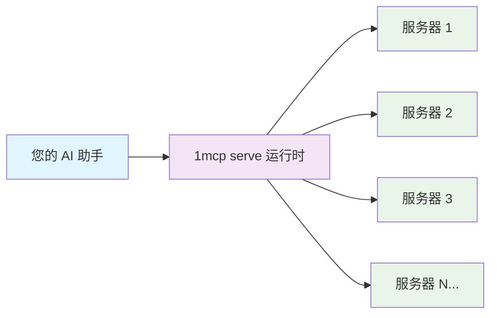

# 核心功能

> **🎯 人人可得**：开箱即用的基础功能，适用于每个用户

## 🔗 通用 MCP 聚合

**功能描述**：通过一个端点连接到所有 MCP 服务器
**适用场景**：不再管理数十个单独的服务器连接
**优势特点**：一个配置文件、一个健康检查、一个连接管理



**⏱️ 设置时间**：5 分钟
**🎯 适用场景**：使用 2+ 个 MCP 服务器的任何人
**✅ 获得收益**：统一接口、运行时健康端点、集中式连接管理

---

## 🔄 热配置重载

**功能描述**：无需重启或丢失连接即可更新服务器配置
**适用场景**：零停机时间内即时添加/移除 MCP 服务器
**优势特点**：编辑配置文件 → 30 秒内自动应用更改

**实际示例**：

```bash
# 编辑您的配置文件
vim ~/.config/1mcp/mcp.json

# 添加新服务器：
"new-server": {
  "command": "npx",
  "args": ["-y", "@modelcontextprotocol/server-web"],
  "tags": ["web", "search"]
}

# 保存文件 → 服务器自动检测和连接
# 无需重启，保持现有连接
```

**⏱️ 设置时间**：内置（无需设置）
**🎯 适用场景**：开发、生产环境、频繁配置更改
**✅ 获得收益**：零停机时间更新、即时服务器添加/移除、保持会话

---

## 📊 基本状态监控

**功能描述**：为 MCP 服务器提供日志记录和基本状态信息
**适用场景**：跟踪服务器连接和排除问题
**优势特点**：结构化日志、连接状态、错误跟踪

**状态信息**：

- 通过结构化日志提供服务器状态。
- 通过 MCP 协议响应提供连接信息。
- 提供健康端点来检查系统状态。
- 通过应用程序日志进行监控，高级健康监控请参见[企业功能](/zh/guide/advanced/enterprise)。

**⏱️ 设置时间**：自动
**🎯 适用场景**：生产监控、故障排除、系统可靠性
**✅ 获得收益**：结构化日志、错误跟踪、连接监控

---

## 核心功能入门

### 快速设置路径

1. **[5 分钟]** 基本 MCP 聚合 → [快速开始](/zh/guide/getting-started)
2. **配置** → [配置指南](/zh/guide/essentials/configuration)
3. **故障排除** → 检查日志和状态信息

### 下一步

- **添加安全性** → [安全功能](/zh/guide/advanced/security)
- **扩展性能** → [性能功能](/zh/guide/advanced/performance)
- **生产就绪** → [企业功能](/zh/guide/advanced/enterprise)

---

> **💡 专业提示**：这些核心功能零配置开箱即用。从这里开始，然后根据需求增长添加高级功能。
