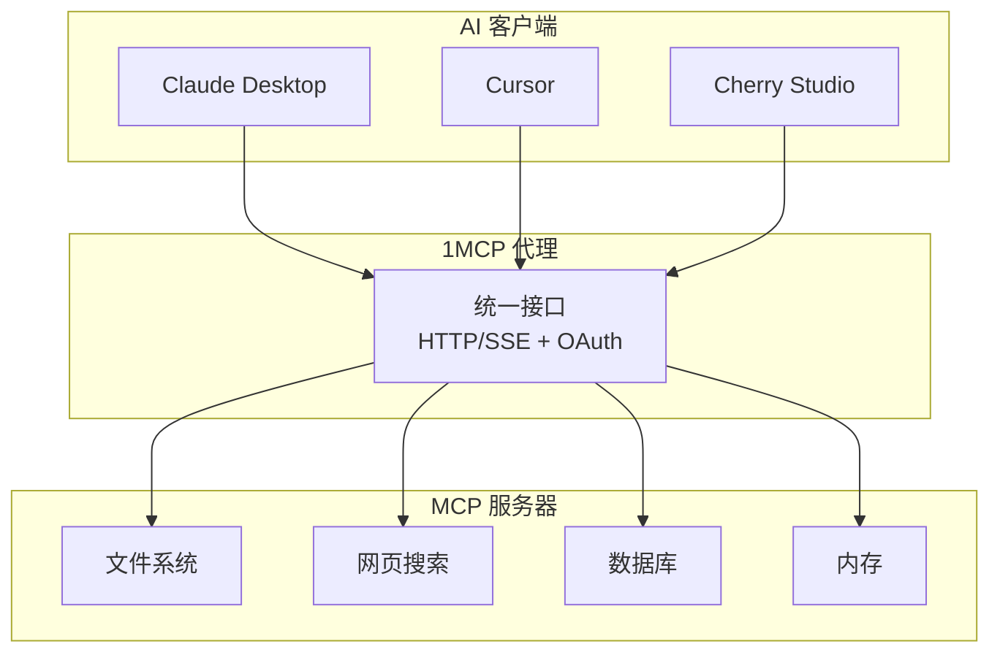
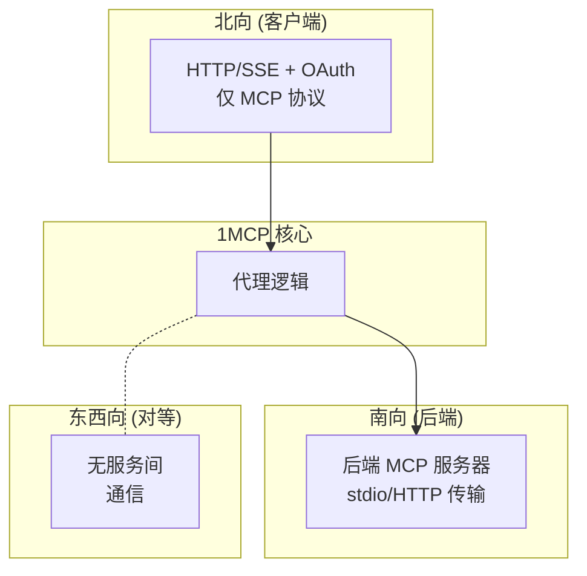
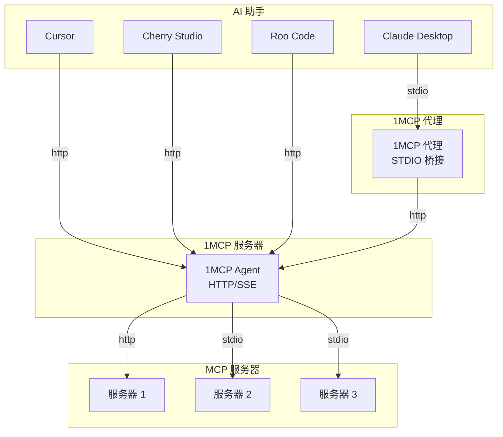
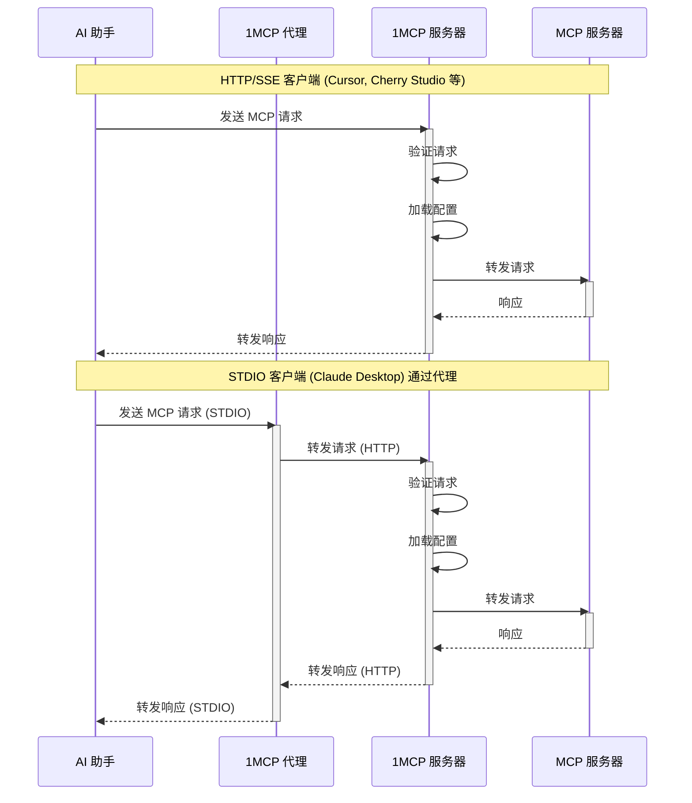

# 1MCP 系统架构

> **愿景**：一个统一、可靠的代理，使多个 MCP 服务器看起来像一个，简化 AI 助手集成，同时保持安全性和性能。

## 🎯 目的与背景

**问题**：AI 助手需要连接到多个 MCP 服务器，但管理数十个单独的连接是复杂、不可靠且安全密集的。

**解决方案**：1MCP 充当统一的代理/多路复用器，将多个 MCP 服务器聚合在单个可靠的接口后面。

**成功指标**：

- **可靠性**：通过适当的错误处理实现稳定运行
- **性能**：高效地将请求转发到后端服务器
- **安全性**：OAuth 2.1 认证和安全默认设置
- **简单性**：单个配置文件，易于部署



## 📏 系统约束

### **硬性约束**

- **单个二进制文件**：必须作为单个可执行文件部署，无外部依赖
- **MCP 协议**：必须 100% 兼容 MCP [最新规范](https://modelcontextprotocol.io/specification/latest)
- **Stdio 传输**：后端服务器通过 stdio 或可流式传输的 http 通信 (安全边界)
- **配置**：所有配置通过单个 JSON 文件，可热重载

### **软性约束**

- **并发连接**：处理多个同时的客户端连接
- **后端服务器**：每个实例支持多个 MCP 服务器
- **网络**：在企业防火墙后工作 (仅 HTTP/SSE)
- **启动时间**：快速启动以进行开发迭代
- **依赖项**：最少的外部依赖以确保安全

### **为何有这些约束**

- **单个二进制文件**：企业部署要求 - 无复杂设置
- **多传输**：后端服务器支持 stdio、HTTP 和可流式传输的 HTTP 传输
- **热重载**：需要零停机配置更新

## 🏗️ 架构原则

### **原则 1：可靠性优于性能**

- 即使单个后端失败，系统也必须保持运行
- 优雅降级优于快速失败
- 具有重试逻辑和超时的连接管理

### **原则 2：默认安全**

- 除非明确禁用，否则所有端点都需要认证
- 后端服务器在具有安全传输协议的隔离进程中运行
- 对所有外部数据进行输入清理
- 日志中无敏感数据

### **原则 3：简单性优于灵活性**

- 单一部署模型，不可配置
- 尽可能约定优于配置
- 显式行为而非隐式行为

### **原则 4：对客户端透明**

- MCP 协议合规性 - 客户端不知道它是一个代理
- 错误消息保留后端服务器上下文
- 无协议修改或扩展

## 🔄 决策框架

在评估新功能或更改时，请问：

### **可靠性问题**

- 这会降低系统可用性吗？
- 如果此组件失败会怎样？
- 系统可以在没有它的情况下继续运行吗？

### **安全性问题**

- 这会扩大攻击面吗？
- 这会泄露敏感信息吗？
- 我们是否在维护深度防御？

### **简单性问题**

- 这会增加配置复杂性吗？
- 这会使部署更困难吗？
- 我们可以用现有的模式解决这个问题吗？

### **兼容性问题**

- 这会破坏 MCP 协议合规性吗？
- 现有客户端会继续工作吗？
- 我们是否在保留后端服务器接口？

## 📊 质量属性场景

### **可靠性场景**

- **情况**：后端 MCP 服务器在请求处理期间崩溃
- **响应**：系统检测到故障，将服务器标记为不可用，如果适用，在其他服务器上重试请求
- **衡量**：<5 秒恢复，客户端收到适当的错误，系统保持可用
- **当前**：带有健康检查的连接池，指数退避重试

### **安全性场景**

- **情况**：客户端尝试在没有适当授权的情况下访问 MCP 服务器
- **响应**：OAuth 令牌验证，范围检查，请求被拒绝并返回 403
- **衡量**：零未经授权的访问，所有尝试都与客户端上下文一起记录
- **当前**：具有基于范围的授权的 OAuth 2.1，会话管理

### **性能场景**

- **情况**：多个并发客户端向后端服务器发出请求
- **响应**：高效的请求转发，适当的错误处理，异步处理
- **衡量**：可靠的请求处理，系统保持响应
- **当前**：具有适当错误处理的 Express.js，异步请求转发

### **可维护性场景**

- **情况**：将新的 MCP 服务器添加到配置文件中
- **响应**：热重载检测到更改，生成新的服务器进程，更新路由
- **衡量**：<30 秒可用，零停机
- **当前**：带有去抖动重载的文件系统监视，优雅的进程管理

## 🚫 系统边界与反模式

### **我们是什么**

- **MCP 协议代理**：忠实实现 MCP 规范
- **认证网关**：OAuth 2.1 安全层
- **连接多路复用器**：多对多客户端到服务器
- **进程管理器**：后端服务器的生命周期管理

### **我们不是什么**

- **业务逻辑引擎**：无数据转换或业务规则
- **缓存层**：每个请求都到后端 (目前)
- **服务网格**：不是通用的服务通信层
- **数据库**：不持久化存储应用程序数据

### **集成边界**



### **我们避免的反模式**

- **共享数据库**：实例之间无共享状态
- **网络依赖**：运行时不调用外部服务
- **协议扩展**：无 MCP 协议修改
- **同步链**：请求路径中无阻塞调用
- **全局状态**：所有状态都是请求范围或配置

## 🗺️ 演进策略

### **阶段 1：单实例代理** (当前)

- **范围**：每次部署一个 1MCP 实例
- **功能**：HTTP/SSE 传输，OAuth，基本连接池
- **约束**：无水平扩展，仅本地配置

### **阶段 2：增强功能** (未来)

- **范围**：基于用户反馈的其他操作功能
- **功能**：增强的监控，高级配置选项
- **迁移**：向后兼容，可选增强

### **阶段 3：高级功能** (未来)

- **范围**：用于企业用例的高级功能
- **功能**：增强的安全性，操作改进
- **迁移**：配置扩展，无协议更改

### **演进原则**

- **向后兼容性**：现有部署继续工作
- **渐进增强**：新功能是可选的
- **零停机**：所有迁移都支持热升级
- **配置驱动**：通过配置启用功能

## ⚡ 架构验证

### **自动化架构测试**

```typescript
// 示例：架构测试强制执行我们的边界
describe('架构约束', () => {
  test('传输层中无业务逻辑', () => {
    // 静态分析确保传输仅处理 HTTP/认证
  });

  test('所有外部调用都使用断路器', () => {
    // 验证是否使用了弹性模式
  });

  test('存储库之外无直接数据库访问', () => {
    // 强制执行数据访问模式
  });
});
```

### **架构指标**

- **依赖违规**：0 (由测试强制执行)
- **圈复杂度**：<10 每个函数 (linting)
- **安全扫描**：0 高/严重漏洞
- **API 兼容性**：100% MCP 协议合规性
- **测试覆盖率**：>90% 关键路径

### **持续验证**

- 架构测试在 CI/CD 管道中运行
- 拉取请求中的依赖分析
- 每次构建都进行安全扫描
- 性能回归测试

## 🔍 可观察性与监控

### **健康指标**

- **系统健康**：所有核心组件正常运行
- **后端健康**：单个 MCP 服务器状态
- **连接健康**：客户端连接池状态
- **配置健康**：配置文件有效性和重载状态

### **关键指标**

- **可用性**：系统正常运行时间百分比
- **延迟**：请求响应时间分布
- **吞吐量**：每秒请求容量
- **错误率**：失败请求百分比
- **资源使用**：内存、CPU、连接数

### **监控指标**

- **严重**：系统不可用，认证失败，配置错误
- **警告**：后端服务器断开连接，重复请求失败
- **信息**：配置已重载，新的客户端连接，成功操作

## 🚨 故障模式与恢复

### **故障类别**

#### **后端服务器故障**

- **症状**：进程崩溃，无响应，无效响应
- **检测**：健康检查，请求超时，错误模式
- **恢复**：进程重启，连接重试，优雅降级
- **升级**：从轮换中移除，提醒操作员

#### **配置故障**

- **症状**：无效的 JSON，缺少服务器，权限错误
- **检测**：文件解析错误，验证失败
- **恢复**：保留以前的有效配置，记录错误
- **升级**：禁用热重载，需要手动干预

#### **资源耗尽**

- **症状**：高内存使用，达到连接限制，响应缓慢
- **检测**：资源监控，性能下降
- **恢复**：连接节流，优雅降级，负载削减
- **升级**：服务重启，水平扩展

#### **安全漏洞**

- **症状**：认证绕过，未经授权的访问，令牌泄露
- **检测**：安全监控，异常检测，审计日志
- **恢复**：立即隔离服务，撤销令牌，取证分析
- **升级**：完全关闭服务，事件响应程序

### **恢复期望**

- **后端重新连接**：自动重试逻辑
- **配置重载**：立即检测和应用
- **安全事件**：立即认证失败响应
- **系统恢复**：根据需要重启和重载

## 🏗️ 代码结构与组织

### **项目布局**

代码库遵循分层架构，具有清晰的关注点分离：

```
src/
├── application/             # 应用级服务
│   └── services/            # 横切编排服务
│       ├── configReloadService.ts
│       ├── healthService.ts
│       └── tokenEstimationService.ts
├── auth/                    # 认证与授权
│   ├── storage/             # 认证数据仓库模式
│   ├── sdkOAuthClientProvider.ts
│   ├── sdkOAuthServerProvider.ts
│   └── sessionTypes.ts
├── commands/                # CLI 命令实现
│   ├── app/                 # 应用管理命令
│   ├── mcp/                 # MCP 服务器管理命令
│   ├── preset/              # 预设管理命令
│   ├── proxy/               # 代理命令
│   ├── serve/               # 服务器命令
│   └── shared/              # 共享命令工具
├── config/                  # 配置管理
│   ├── configContext.ts
│   ├── mcpConfigManager.ts
│   ├── envProcessor.ts
│   ├── projectConfigLoader.ts
│   └── projectConfigTypes.ts
├── constants/               # 按域组织的常量
│   ├── api.ts               # API 端点、端口、主机
│   ├── auth.ts              # 认证常量
│   ├── mcp.ts               # MCP 协议常量
│   ├── paths.ts             # 文件路径、目录
│   └── index.ts             # 桶导出
├── core/                    # 核心业务逻辑
│   ├── capabilities/        # MCP 能力管理
│   ├── client/              # 客户端管理
│   ├── filtering/           # 请求过滤逻辑
│   ├── instructions/        # 模板引擎
│   ├── loading/             # 异步加载编排
│   ├── notifications/       # 通知系统
│   ├── protocol/            # 协议消息处理器
│   ├── server/              # 服务器生命周期管理
│   └── types/               # 共享类型定义
├── domains/                 # 域模块
│   ├── backup/              # 备份管理域
│   ├── discovery/           # 应用发现域
│   ├── preset/              # 预设管理域
│   │   ├── manager/         # PresetManager
│   │   ├── parsers/         # 标签查询解析
│   │   ├── services/        # 预设服务
│   │   └── types/           # 预设类型
│   └── registry/            # MCP 注册表域
│       ├── formatters/      # 注册表特定格式化器
│       ├── cacheManager.ts  # 注册表缓存
│       ├── mcpRegistryClient.ts  # 注册表客户端
│       ├── mcpToolSchemas.ts     # 注册表模式
│       ├── searchFiltering.ts    # 注册表搜索
│       └── types.ts         # 注册表类型
├── logger/                  # 日志基础设施
│   ├── configureGlobalLogger.ts
│   └── [6 个其他日志文件]
├── transport/               # 传输层实现
│   ├── http/                # HTTP/SSE 传输
│   │   ├── middlewares/     # Express 中间件
│   │   └── routes/          # API 路由处理器
│   └── [5 个传输文件]
└── utils/                   # 通用工具
    ├── core/                # 核心工具
    ├── ui/                  # CLI 工具
    └── validation/          # 输入验证
```

### **架构层**

#### **1. 应用层 (`application/`)**

- **目的**：横切编排服务
- **职责**：配置重载、健康监控、令牌估算
- **依赖**：可以依赖核心和域
- **示例**：`configReloadService`、`healthService`

#### **2. 核心层 (`core/`)**

- **目的**：核心业务逻辑和域实体
- **职责**：MCP 协议处理、能力管理、服务器生命周期
- **依赖**：不应依赖应用层
- **示例**：`ServerManager`、`ClientManager`、`CapabilityManager`

#### **3. 域层 (`domains/`)**

- **目的**：自包含的业务域
- **职责**：特定业务逻辑（预设、发现、备份、注册表）
- **依赖**：可以依赖核心，应该独立
- **示例**：`PresetManager`、`BackupManager`、`AppDiscovery`、`McpRegistryClient`

#### **4. 传输层 (`transport/`)**

- **目的**：协议实现和通信
- **职责**：HTTP/SSE、STDIO、消息路由
- **依赖**：可以依赖核心和应用
- **示例**：`ExpressServer`、`StdioTransport`

#### **5. 基础设施层 (`auth/`、`config/`、`logger/`)**

- **目的**：横切基础设施关注点
- **职责**：认证、配置、日志
- **依赖**：最小依赖，被所有层使用
- **示例**：`McpConfigManager`、`OAuthClientProvider`

### **设计原则**

#### **领域驱动设计**

- **域**：具有清晰边界的自包含模块
- **服务**：应用级编排
- **核心**：共享业务逻辑和实体

#### **依赖方向**

```
应用 → 核心 → 域
  ↓      ↓
传输 → 基础设施
```

#### **文件组织**

- **共置**：相关文件分组在一起
- **桶导出**：使用 `index.ts` 的清晰导入路径
- **域边界**：清晰的所有权和职责

#### **命名约定**

- **管理器**：`*Manager.ts` 用于有状态服务
- **服务**：`*Service.ts` 用于无状态操作
- **类型**：`*Types.ts` 用于类型定义
- **工具**：仅通用工具

### **迁移收益**

重构后的代码库提供：

- **57% 减少** 工具文件（47 → 20）
- **清晰的域边界** 与专用模块
- **更好的可维护性** 通过有组织的结构
- **改进的可扩展性** 与独立域
- **增强的开发者体验** 与清晰的文件位置

## 工作原理

1MCP 作为代理，管理和聚合多个 MCP 服务器。它启动和停止这些服务器作为子进程，并将来自 AI 助手的请求转发到适当的服务器。这种架构允许所有 MCP 流量的单一入口点，简化管理并减少开销。

### 系统架构



### 请求流程



---

> **此架构作为我们的决策框架。如有疑问，请参考我们的原则和约束。所有更改都应加强这些基础，而不是削弱它们。**
