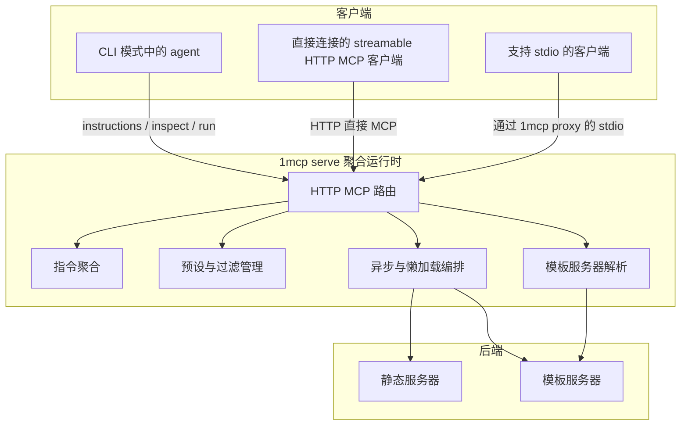

# 1MCP 架构

理解 1MCP 时，需要同时把两层看清楚：

- `1mcp serve` 是聚合运行时。
- CLI 模式是在这个运行时之上的、面向 agent 的渐进式工作流。

CLI 模式并不替代 MCP。它改变的是 agent 发现和执行工具的方式，而运行时本身仍然对客户端和后端服务器使用 MCP。

## 系统概览


```mermaid
flowchart TB
    subgraph Clients["客户端"]
        A1[CLI 模式中的 agent]
        A2[直接连接的 streamable HTTP MCP 客户端]
        A3[支持 stdio 的客户端]
    end

    subgraph Runtime["1mcp serve 聚合运行时"]
        B1[HTTP MCP 路由]
        B2[指令聚合]
        B3[预设与过滤管理]
        B4[异步与懒加载编排]
        B5[模板服务器解析]
    end

    subgraph Backends["后端"]
        C1[静态服务器]
        C2[模板服务器]
    end

    A1 -->|instructions / inspect / run| B1
    A2 -->|HTTP 直接 MCP| B1
    A3 -->|通过 1mcp proxy 的 stdio| B1
    B1 --> B2
    B1 --> B3
    B1 --> B4
    B1 --> B5
    B5 --> C2
    B4 --> C1
    B4 --> C2
```

运行时统一负责服务器生命周期、传输路由、过滤、指令收集，以及带有会话感知能力的模板处理。当前架构的关键变化在于：1MCP 不再只是一个“代理层”的故事，它是一个可以通过不同客户端入口暴露同一份聚合服务能力的运行时。

## 主要运行流程

### 启动流程

1. `serve` 加载配置并初始化配置变更处理。
2. 初始化预设管理，包括预设变更通知。
3. 根据启动配置创建静态服务器传输。
4. 模板服务器不会在启动时全部实例化，而是在拿到客户端或会话上下文后再创建。
5. 运行时进入同步加载模式或异步加载模式。

### Agent CLI 流程

1. 用户通过 `1mcp cli-setup --codex` 或 `1mcp cli-setup --claude --scope repo --repo-root .` 完成引导。
2. agent 通过 `instructions`、`inspect`、`run` 与正在运行的 `serve` 实例交互。
3. 上下文会逐步从“服务器清单”收窄到“单个服务器”再到“单个工具 schema”和“单次工具调用”。

### 直接 MCP 流程

1. 原生 MCP 客户端连接到 `serve` 暴露的 HTTP 端点。
2. 运行时解析过滤器、预设、认证以及可用连接。
3. 工具列表和工具调用都来自这份聚合后的服务目录。

### stdio proxy 流程

1. 支持 stdio 的客户端启动 `1mcp proxy`。
2. `proxy` 发现一个运行中的 `serve` 实例，并把 stdio 流量转发到 HTTP 运行时。
3. 过程中仍可应用预设、`.1mcprc` 与模板上下文，因此 `proxy` 是 CLI 模式之后更推荐的回退路径。

## 关键组件

### 聚合运行时

`1mcp serve` 是长期运行的主进程，负责配置加载、客户端路由、传输暴露以及后端服务器管理。

### Server manager

运行时维护 server manager 来跟踪出站服务器连接和入站客户端会话，并处理指令更新与模板服务器的生命周期清理。

### 指令聚合

指令聚合是系统中的一等能力。静态服务器和模板服务器都可以提供 instructions，运行时会把它们组合起来提供给客户端和 CLI 模式。

### 模板服务器管理器

模板服务器不是固定启动清单，而是根据上下文渲染出来的。它们可以是可共享的，也可以按会话隔离；运行时会跟踪 rendered hash 与 session 映射，以保证路由和清理正确。

### 预设管理与通知

预设在服务启动时就会初始化。预设变更可以触发通知，让已连接客户端在不把预设视为“运行时外配置”的前提下感知到目录变化。

## 加载模型

当前运行时同时支持启动期加载和渐进式加载行为。

### 静态服务器与模板服务器

- 静态服务器从启动配置中创建。
- 模板服务器在获得客户端或会话上下文后按需创建。

### 异步加载

启用 async loading 后，HTTP 运行时可以先启动，而静态 MCP 服务器在后台继续加载。这样可以减少启动阻塞，并更早暴露部分可用性。

### 懒加载

启用 lazy loading 后，服务暴露面可以在真正需要前保持更窄。懒加载是运行时的一部分，而不是额外的代理技巧。

### 加载过程中的指令行为

即使后端服务尚未全部就绪，指令聚合也会先初始化。随着更多服务器变为可用，运行时可以更新指令视图和客户端看到的清单。

## 配置 / 预设 / 模板

当前系统已经不能简单概括为“一个 JSON 文件”。实际配置面包括：

- 静态服务器的启动配置
- 依赖上下文渲染的模板定义
- 预设定义与预设选择
- CLI 或项目级选项，例如过滤器与 `.1mcprc`
- 异步加载、懒加载、会话持久化等运行时特性开关

在需要时，模板服务器解析是带有会话感知能力的。inspect 路由与 tool 路由可以基于请求上下文和 session ID 初始化模板服务器，使客户端看到正确的上下文感知服务目录。

## 客户端接口

1MCP 目前有三个面向客户端的入口：

### CLI 模式

这是 agent loop 的推荐路径：

```bash
1mcp instructions
1mcp inspect <server>
1mcp inspect <server>/<tool>
1mcp run <server>/<tool> --args '<json>'
```

CLI 模式是面向 agent 的渐进式接口，不是新的传输协议。

### 直接 HTTP MCP 接入

适用于能通过 streamable HTTP 直接连接聚合运行时，且不需要项目上下文的原生 MCP 客户端。

### `proxy`

`1mcp proxy` 是 CLI 模式之后的最大兼容性入口。它把本地 stdio 客户端桥接到运行中的 HTTP 运行时，同时通过 `.1mcprc` 保留项目上下文，并支持模板感知的运行时行为。

## 安全与运维边界

- `serve` 是运行时边界，认证、限流、请求处理与健康检查都在这里。
- 模板解析发生在运行时内部，并受提供给它的客户端或会话上下文约束。
- `proxy` 不会给 stdio 客户端凭空增加 OAuth 能力；如果客户端本身不能完成认证，这个限制仍然存在。
- 预设和过滤可以缩小暴露面，但它们不能替代传输层认证或服务端运维控制。

总结来说：当前 1MCP 的架构是“一个统一运行时 + 多个客户端入口”，而不只是“HTTP 外壳 + 子进程代理”。
