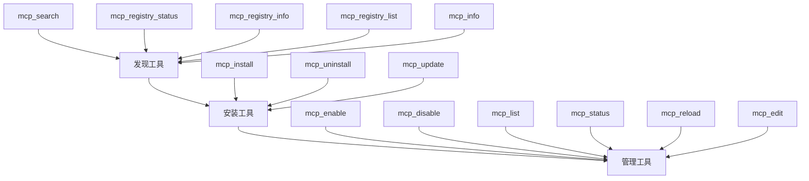

# 内部工具概述

内部工具是通过 MCP 协议暴露给 AI 助手的工具，使其能够以编程方式管理 1MCP 生态系统中的 MCP 服务器。这些工具提供全面的服务器发现、安装和运营管理自动化能力。

## 目的与设计

内部工具专门为 **AI 助手集成**而设计，而非人工交互。虽然 CLI 命令提供用户友好的服务器管理界面，但内部工具提供程序化访问，具有：

- **结构化输入/输出** 遵循 MCP 协议标准
- **全面架构** 具有验证和类型安全
- **原子操作** 支持回滚和错误处理
- **自动化友好** 的工作流和状态管理

## 启用内部工具

内部工具默认禁用，必须通过 CLI 标志或环境变量明确启用。这确保只有预期的 AI 助手可以访问这些强大的管理功能。

### CLI 标志

启动 1MCP 服务器时启用内部工具：

```bash
# 启用所有内部工具
./build/index.js serve --enable-internal-tools

# 按名称启用特定工具
./build/index.js serve --internal-tools="search,list,status,registry"

# 按类别启用工具
./build/index.js serve --internal-tools="discovery,management"

# 仅启用安全（只读）工具
./build/index.js serve --internal-tools="safe"
```

### 可用工具类别

- **discovery**：注册表搜索和服务器发现工具
- **installation**：服务器安装、更新和移除工具
- **management**：服务器控制和配置工具
- **safe**：只读工具（发现 + 只读管理）

### 单个工具

- **search**：`mcp_search` - 在 MCP 注册表中搜索服务器
- **list**：`mcp_list` - 列出带有状态的 MCP 服务器
- **status**：`mcp_status` - 获取详细的服务器状态
- **registry**：注册表管理工具
- **install/uninstall/update**：安装工具
- **enable/disable/edit**：管理工具

### 安全注意事项

启用内部工具时：

- **最小权限原则**：仅启用您用例所需的工具
- **网络安全**：确保 1MCP 仅可受信任的 AI 助手访问
- **使用安全模式**：在可能的情况下考虑使用 `--internal-tools="safe"` 进行只读操作
- **监控使用情况**：定期审查 AI 助手正在使用哪些工具

### 示例

```bash
# 开发环境 - 完全访问
./build/index.js serve --enable-internal-tools

# 生产环境 - 仅发现和管理
./build/index.js serve --internal-tools="discovery,management"

# 只读监控设置
./build/index.js serve --internal-tools="safe"

# 特定服务器管理场景
./build/index.js serve --internal-tools="search,list,status,enable,disable"
```

## 工具架构

内部工具系统被组织为三个逻辑领域，镜像服务器生命周期：



## 工作流模式

### 典型的 AI 助手工作流

AI 助手通常在使用内部工具时遵循以下模式：

1. **发现阶段**
   - 使用 `mcp_registry_status` 检查注册表可用性
   - 使用 `mcp_search` 查找相关服务器
   - 使用 `mcp_info` 获取详细的服务器信息

2. **安装阶段**
   - 使用 `mcp_install` 安装所需的服务器
   - 使用 `mcp_status` 验证安装成功
   - 使用 `mcp_list` 确认服务器可用性

3. **管理阶段**
   - 使用 `mcp_enable`/`mcp_disable` 控制服务器状态
   - 使用 `mcp_status` 进行持续健康监控
   - 使用 `mcp_reload`/`mcp_edit` 进行配置更改

### 自动化工作流示例

```javascript
// AI 助手为开发环境设置的示例工作流

async function setupDevelopmentEnvironment() {
  // 1. 发现可用服务器
  const registryStatus = await mcp_registry_status();
  if (!registryStatus.isAvailable) {
    throw new Error('注册表不可用');
  }

  // 2. 搜索开发工具
  const devTools = await mcp_search({
    query: '开发调试工具',
    category: 'development',
  });

  // 3. 安装所需服务器
  const installations = [];
  for (const server of devTools.results) {
    const installResult = await mcp_install({
      name: server.name,
      version: server.recommendedVersion,
    });
    installations.push(installResult);
  }

  // 4. 验证安装
  const serverList = await mcp_list();
  const installedServers = serverList.servers.filter((server) => server.status === 'running');

  // 5. 根据需要启用服务器
  for (const server of installedServers) {
    if (server.disabled) {
      await mcp_enable({ name: server.name });
    }
  }

  return {
    installed: installations.length,
    running: installedServers.length,
    servers: installedServers,
  };
}
```

## 关键能力

### 安全操作

所有内部工具优先考虑操作安全性：

- **事务支持** 支持回滚能力
- **依赖验证** 防止破坏性更改
- **健康检查** 操作前后验证
- **备份创建** 用于破坏性操作
- **原子提交** 配置适当的清理

### 丰富反馈

工具提供全面的操作反馈：

- **进度指示器** 用于长时间运行的操作
- **详细状态信息** 包括日志和指标
- **错误上下文** 提供建议的解决方案
- **操作历史** 用于审计和调试

### 集成特性

专为 AI 助手集成设计：

- **语义化命名** 遵循 MCP 约定
- **一致的架构** 跨所有工具
- **跨工具兼容性** 共享数据结构
- **可扩展设计** 支持未来工具添加

## 工具领域

### 发现工具

专注于发现和评估 MCP 服务器：

- **注册表集成** 支持多个注册表源
- **高级搜索** 支持过滤和分类
- **服务器信息** 包含功能和需求
- **健康监控** 用于注册表服务

### 安装工具

处理完整的服务器生命周期管理：

- **灵活安装** 支持多种来源（注册表、git、自定义）
- **版本管理** 支持依赖解析
- **安全卸载** 支持备份和回滚
- **更新自动化** 支持兼容性检查

### 管理工具

提供运营控制和监控：

- **状态管理** 支持优雅的状态转换
- **配置编辑** 支持验证和热重载
- **健康监控** 提供详细诊断
- **性能跟踪** 支持指标和警报

## 与 CLI 命令的比较

| 方面           | 内部工具      | CLI 命令        |
| -------------- | ------------- | --------------- |
| **目标用户**   | AI 助手       | 人类            |
| **接口**       | MCP 协议      | 命令行          |
| **输出格式**   | 结构化数据    | 人类可读文本    |
| **错误处理**   | 结构化异常    | 用户友好的消息  |
| **自动化**     | 原生支持      | 需要手动脚本    |
| **批处理操作** | 内置功能      | 需要 shell 脚本 |
| **集成**       | 直接 MCP 访问 | 外部进程执行    |

## 最佳实践

### 对于 AI 助手开发者

- **使用结构化错误处理** 和适当的异常处理
- **实现重试逻辑** 处理临时故障
- **缓存服务器信息** 减少注册表调用
- **验证先决条件** 在操作之前
- **监控操作进度** 并提供用户反馈

### 对于工具用户

- **规划操作** 在执行前了解依赖关系
- **使用状态检查** 验证操作成功
- **实施备份策略** 用于关键服务器
- **定期监控服务器** 状况
- **记录自定义配置** 确保可重现性

## 下一步

- **[发现工具](./discovery)** - 了解服务器发现能力
- **[安装工具](./installation)** - 了解安装和生命周期管理
- **[管理工具](./management)** - 探索操作控制功能
- **[主要参考页面](../internal-tools.md)** - 完整参考文档

## 另请参阅

- [MCP 协议规范](https://modelcontextprotocol.io/) - 了解底层协议
- [CLI 命令参考](../../commands/) - 人类友好的服务器管理替代方案
